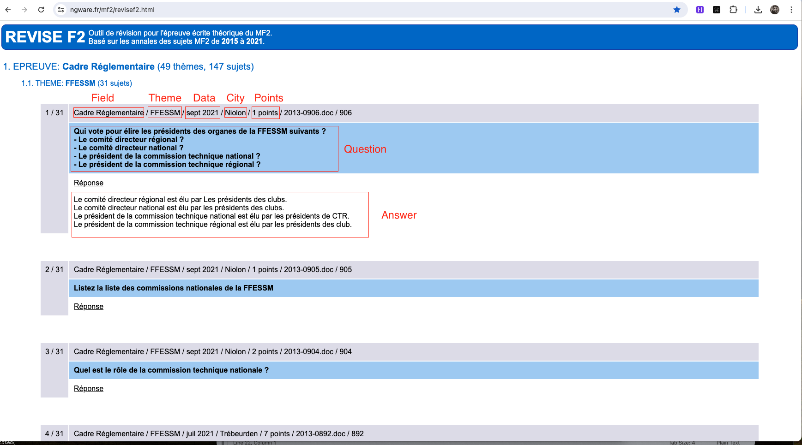
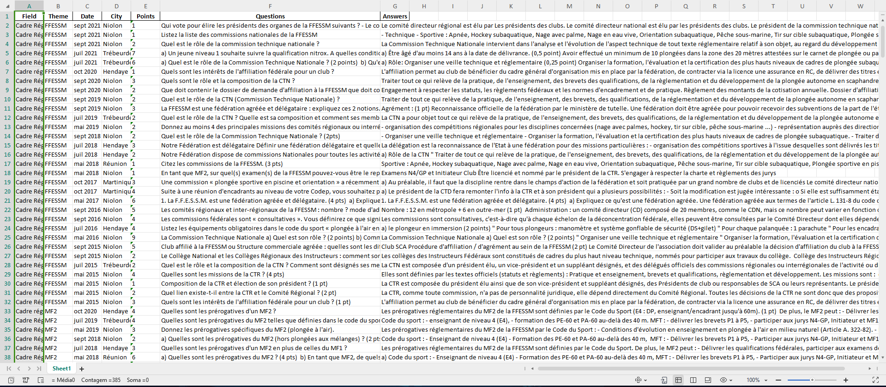

# FrenchQuestionsWebScrap

**Upwork Freelance Job:** Turned a [webpage](https://ngware.fr/mf2/revisef2.html) with 384 questions into a .xlsx/.csv file.
From this:



To this:


### Description

This project involves web scraping a webpage containing 384 French questions and converting the data into an Excel spreadsheet. The data includes sections, questions, and answers. Python's Selenium library is used for web scraping, and Pandas is used for data manipulation and spreadsheet creation.

### Technologies Used

- **Python**: Programming language used for the project.
- **Selenium**: Web scraping library to interact with the webpage.
- **Pandas**: Data manipulation library to organize the data and create the Excel file.
- **time**: Module for managing time-based operations in the script.
- **re**: Regular expression module for cleaning the data.

### Code Overview

The script performs the following steps:

1. **Initialize WebDriver**: Sets up the Chrome WebDriver to access the target webpage.
2. **Navigate to Website**: Opens the target page containing the questions.
3. **Interact with Web Elements**: Clicks on various elements to reveal the questions and answers.
4. **Extract Data**: Collects sections, questions, and answers from the webpage.
5. **Process Data**: Cleans and organizes the data into a Pandas DataFrame.
6. **Remove Illegal Characters**: Filters out any characters that are not allowed in Excel files.
7. **Save Data**: Exports the cleaned data to an Excel file.
8. **Close WebDriver**: Closes the WebDriver session.

### Requirements

To run the script, you need to have the following packages installed:

```bash
pip install selenium pandas openpyxl
